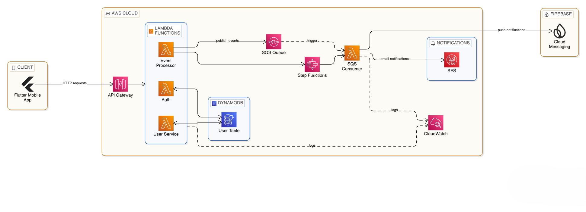
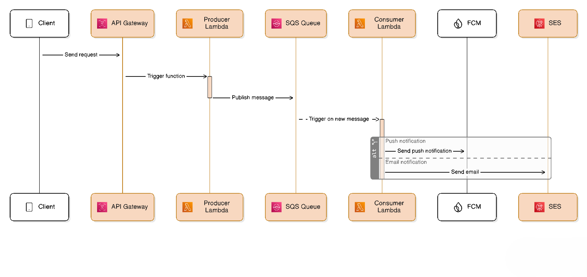
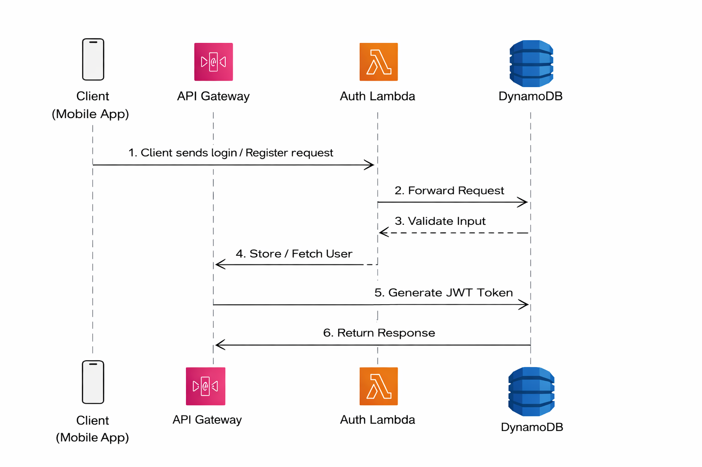

# 🚀 Scalable Serverless Backend for Multi-Role Application

## 🧠 About This Project

This project is a simplified version of a production-grade backend system I built, demonstrating scalable serverless architecture, event-driven processing, and multi-role access control.

It showcases how to design and implement a cloud-native backend using AWS services with a focus on performance, reliability, and real-world use cases.

---

## 🚀 Real-World Relevance

This project is inspired by a production system where:

- Multi-role access (Admin, Supervisor, User) was implemented
- Real-time notifications were delivered using event-driven architecture
- System handled asynchronous workflows using SQS

This repository demonstrates the core architecture and concepts in a simplified form.

---

## 🏗️ Architecture Overview

The system follows a **serverless and event-driven architecture**:

- **API Gateway** – Entry point for client requests
- **AWS Lambda** – Backend business logic
- **DynamoDB** – Scalable NoSQL database
- **SQS** – Asynchronous event processing
- **AWS CDK** – Infrastructure as Code modeling
- **CloudWatch** – Logging and monitoring



---

## 🔄 System Flow

1. Client sends request via API Gateway
2. Lambda function processes request
3. Data is stored/retrieved from DynamoDB
4. Events are pushed to SQS for async processing
5. Consumer Lambda processes events
6. Notifications/logs are generated
7. Monitoring handled via CloudWatch



---

## ⚙️ Tech Stack

- **Backend:** Python (AWS Lambda)
- **Infrastructure as Code:** AWS CDK (Python)
- **Cloud Services:**
  - AWS Lambda
  - API Gateway
  - DynamoDB
  - SQS
  - CloudWatch
- **Libraries:** PyJWT, Boto3

---

## 🔐 Key Features

### 👥 Multi-Role System

- Supports multiple user roles (Admin, User)
- Role-based access control (RBAC)

### 🔑 Authentication & Authorization

- User registration and login APIs
- Token-based authentication (JWT) with password hashing



### ⚡ Event-Driven Architecture

- Decoupled system using SQS
- Asynchronous processing for scalability

### 🔔 Notification System

- Event-based notification handling
- Queue-driven processing for reliability

### 📊 Monitoring & Logging

- CloudWatch logging integration
- Structured logs for debugging and observability

### 🏗️ Structured Codebase

- Built-in validation layer
- Reusable utilities (`src/utils`)
- Structured, decoupled microservices

---

## 📈 Scalability

- AWS Lambda auto-scales with incoming requests  
- SQS enables horizontal scaling of consumers  
- DynamoDB supports high throughput workloads

---

## 🌍 Deployment

This system is designed to be deployed on AWS using **AWS CDK**.

- API Gateway endpoint exposed securely
- Lambda functions deployed automatically from `src/`
- SQS configured for async processing
- DynamoDB tables mapped seamlessly

---

## 🧠 Design Decisions

- Serverless architecture to reduce infrastructure overhead  
- SQS used to decouple services and handle async workflows  
- DynamoDB chosen for scalability and low latency

---

## ⚠️ Reliability & Failure Handling

- SQS ensures message durability  
- Failed messages can be retried  
- Logs captured for debugging  
- System designed to handle async failures gracefully

---

## 📡 API Endpoints

### 🔹 Register User

**POST /register**

```json
{
  "email": "user@example.com",
  "password": "password123",
  "role": "user"
}
```

---

### 🔹 Login User

**POST /login**

```json
{
  "email": "user@example.com",
  "password": "password123"
}
```

---

### 🔹 Get Users (Admin Only)

**GET /users**

- Requires admin authorization (JWT Bearer Token)

---

## 📊 Sample Execution

### API Response
```json
{
  "message": "User registered successfully"
}
```

### CloudWatch Logs
```text
[INFO] Request received  
[INFO] User stored in DynamoDB  
[INFO] Event pushed to SQS  
[INFO] Notification sent  
```

---

## 📁 Project Structure

```text
serverless-multirole-backend/
│
├── infrastructure/               # IaC Definitions
│   └── backend_stack.py          # AWS CDK Stack
│
├── src/                          # Lambda Microservices
│   ├── register_user/app.py
│   ├── login_user/app.py
│   ├── get_users/app.py
│   ├── process_event/app.py      # SQS Consumer 
│   │
│   └── utils/                    # Shared Libraries
│       ├── db.py
│       ├── auth.py
│       └── responses.py
│
├── app.py                        # CDK App Entrypoint
├── cdk.json                      # CDK Config
├── requirements.txt              # Project Deps
└── README.md
```

---

## 🚀 Getting Started

### Prerequisites

- AWS CLI configured
- Node.js & AWS CDK CLI installed (`npm install -g aws-cdk`)
- Python 3.x

---

### Deploy to AWS

```bash
# 1. Install dependencies
pip install -r requirements.txt

# 2. Deploy infrastructure
cdk deploy
```

---

## 🛡️ Security

- IAM roles with least-privilege access
- Input validation and error handling
- Role-based access control within Lambda execution layers

---

## 📈 Future Improvements

- Add API rate limiting via API Gateway Usage Plans
- Implement caching (Redis / DAX)
- Integrate automated Dead Letter Queue (DLQ) alarms
- Add distributed tracing (AWS X-Ray)

---

## 💡 Key Highlights

- Designed as a **real-world backend system**, not a tutorial project
- Demonstrates **serverless and event-driven architecture**
- Built with scalability, reliability, and modularity in mind

---

## 📬 Contact

**Shoeb Khan**
📧 [khan.shoeb006@gmail.com](mailto:khan.shoeb006@gmail.com)
🌐 shoebkhan.com
💻 [https://github.com/Shoeb-K](https://github.com/Shoeb-K)
